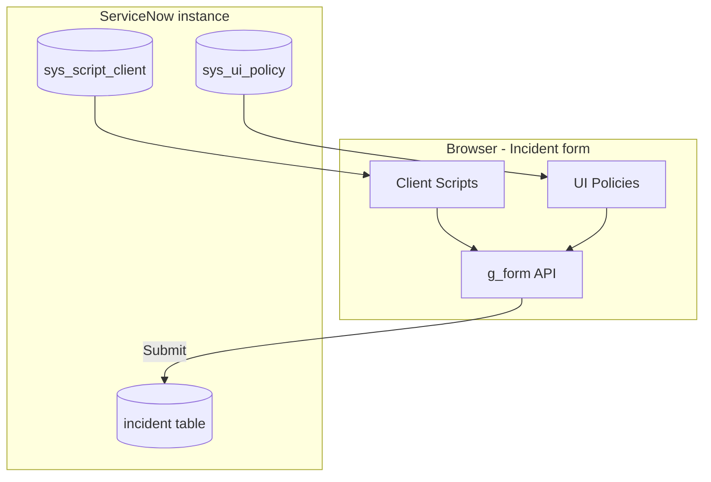

# Phase 3 – Solution Architecture

```mermaid
flowchart TB
    subgraph Client[Browser - Incident form]
        CS[Client Scripts]
        UP[UI Policies]
        GF[g_form API]
    end
    subgraph Server[ServiceNow instance]
        T[(incident table)]
        SC[(sys_script_client)]
        SU[(sys_ui_policy)]
    end
    SC --> CS
    SU --> UP
    CS --> GF
    UP --> GF
    GF -->|Submit| T
```
**Roles:** `admin` creates/edits scripts and policies; `itil` users experience them on the form.
